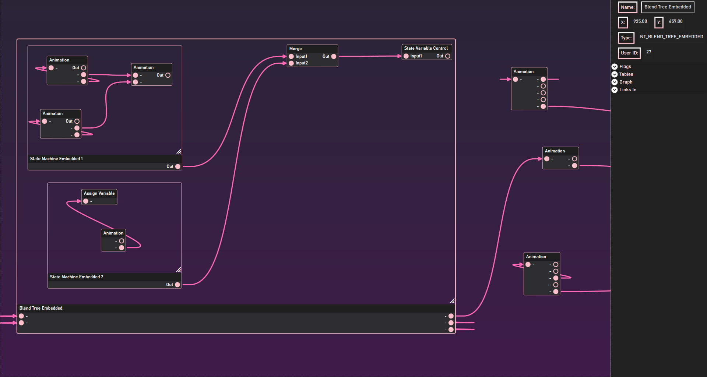

# Starfield-Behavior-Editor
WIP Editor for Starfield agx behavior files.
## What is Behavior?
Behavior is a term derived from Skyrim's 2010 Havok™ Behavior middleware, which is an animation logic system constructed through non-deterministic finite state machines. It can be thought of as a more primitive version of Unreal blueprints dedicated to character locomotions and animation. 

Starfield uses its own in-house behavior solution rather than Havok, but many of the concepts remain transferable. This is a program that can open and edit these files in a graph UI. 

## User Requirements:
* [.NET Runtime7](https://dotnet.microsoft.com/en-us/download/dotnet/7.0)

## Build Instructions:
* [.NET Framework 7 SDK](https://dotnet.microsoft.com/en-us/download/dotnet/7.0)
* [Nodify](https://github.com/miroiu/nodify)

## Development:
The editor uses WPF and follows the [MVVM model](https://learn.microsoft.com/en-us/archive/msdn-magazine/2009/february/patterns-wpf-apps-with-the-model-view-viewmodel-design-pattern).
